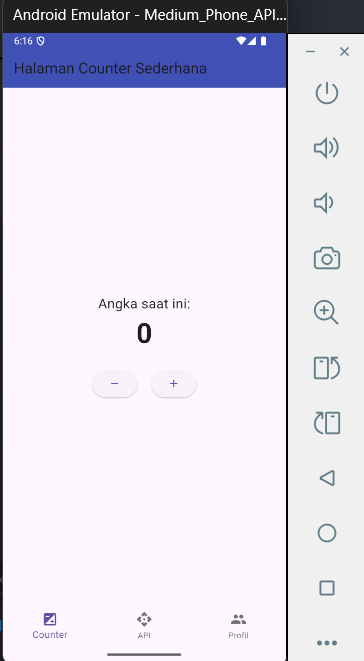
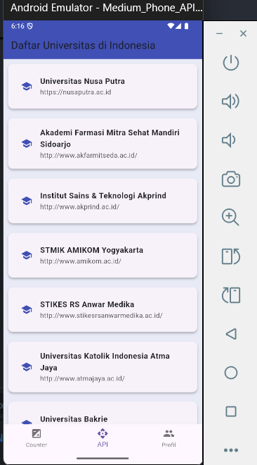
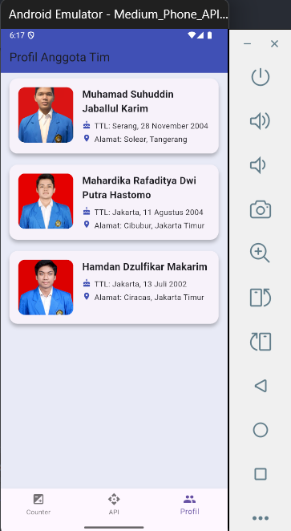

<<<<<<< HEAD
# flutter_aplikasi_sederhana
# Aplikasi Flutter 3 Halaman - Kelompok 3

## Anggota Kelompok:
- Nama: Hamdan Dzulfikar Makarim, NIM: 4522210108
- Nama: Muhammad Suhuddin Jabalul Karim, NIM: 4522210119
- Nama: Mahardika Rafaditya Dwi Putra Hastomo, NIM: 452210146

## Deskripsi Aplikasi:
Aplikasi ini berisi 3 halaman, yaitu:
1. Counter sederhana.
2. Menampilkan data dari API.
3. Profil anggota kelompok.

## Screenshot Halaman:
### Halaman Counter

### Halaman API

### Halaman Profil

## Penjelasan Tiap Halaman:
- **Halaman Counter:**  
    *Menampilkan angka yang dapat bertambah saat tombol "+" ditekan dan menampilkan angka yang dapat berkurang saat tombol "-" ditekan.*
- **Halaman API:** 
    *Menampilkan API data Universitas di Indonesia dalam bentuk list dan ketika ditekan salah satu Universitas, menampilkan data dalam bentuk card.*
- **Halaman Profil:**
    *Menampilkan data anggota tim dalam bentuk card. Setiap card berisi nama, ttl(tempat tanggal lahir), dan alamat anggota tim.*

## Cara Menjalankan Aplikasi:
flutter pub get flutter run
=======
# Flutter-3-Halaman
>>>>>>> de1f95282ed49499c45dd8f41f23f0acf1186711
