# Resep Masakan Nusantara - UAS

## Nama Kelompok
- Hamdan Dzulfikar Makarim - 4522210108
- Muhamad Suhuddin Jaballul karim - 4522210119
-  Mahardika Rafaditya Dwi Putra Hastomo - 4522210146  

## Deskripsi
Aplikasi Resep Masakan Nusantara adalah aplikasi mobile yang dibangun menggunakan Flutter, yang memungkinkan pengguna untuk menemukan berbagai resep masakan tradisional Indonesia. Dengan aplikasi ini, pengguna dapat melihat bahan-bahan, cara pembuatan, dan informasi terkait setiap resep. Aplikasi ini juga menyediakan fitur otentikasi pengguna untuk mempersonalisasi pengalaman mereka, serta pengaturan tema yang memungkinkan pengguna untuk mengubah tampilan aplikasi sesuai preferensi mereka. Aplikasi ini ditujukan untuk mereka yang tertarik dengan masakan Nusantara dan ingin mempelajari resep-resep tradisional Indonesia dengan cara yang mudah dan menyenangkan.

## Fitur Aplikasi 
- *Lihat Resep Masakan Nusantara*: Menampilkan koleksi resep lengkap dengan bahan dan cara pembuatan.
- *Autentikasi Pengguna*: Memungkinkan pengguna untuk melakukan login dan menyimpan preferensi mereka.
- *Pengaturan Tema*: Pengguna dapat mengubah tema aplikasi sesuai dengan preferensi visual mereka.
- *Database Lokal*: Menyimpan informasi resep dan data pengguna secara lokal, memungkinkan akses yang cepat.

## Screenshot Emulator:
| Login Page | Register Page | Home Page | Tambah Resep | Resep Saya |
|------------|----------------|------------|------------|------------|
| 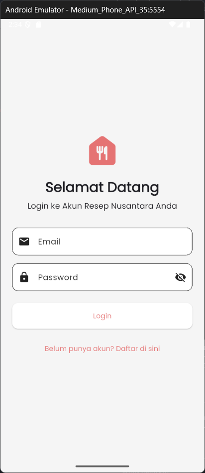 | 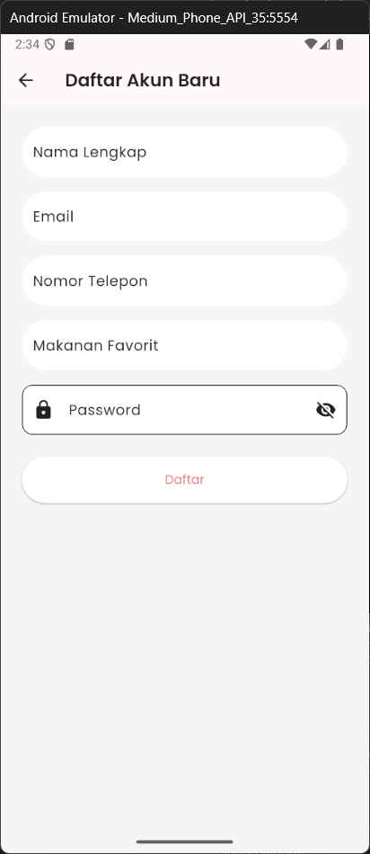 | 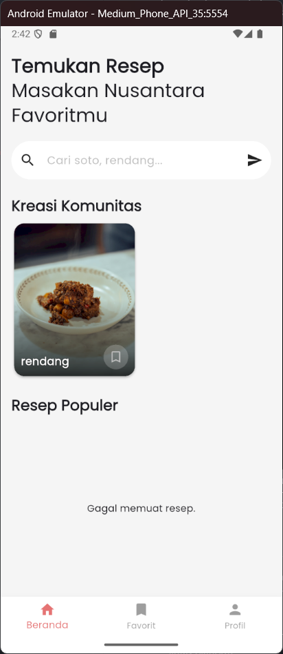 | 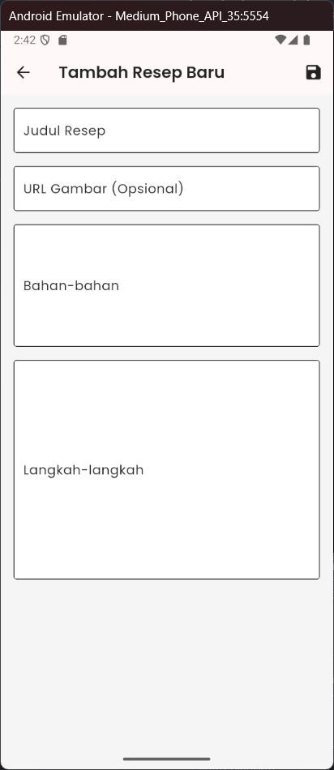 | 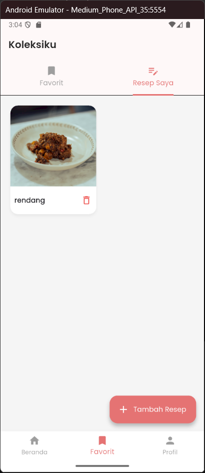 |

| Edit Resep | Profil | Ubah Profil | Dark Mode | Koleksiku |
|------------|--------|-------------|-----------|-----------|
| 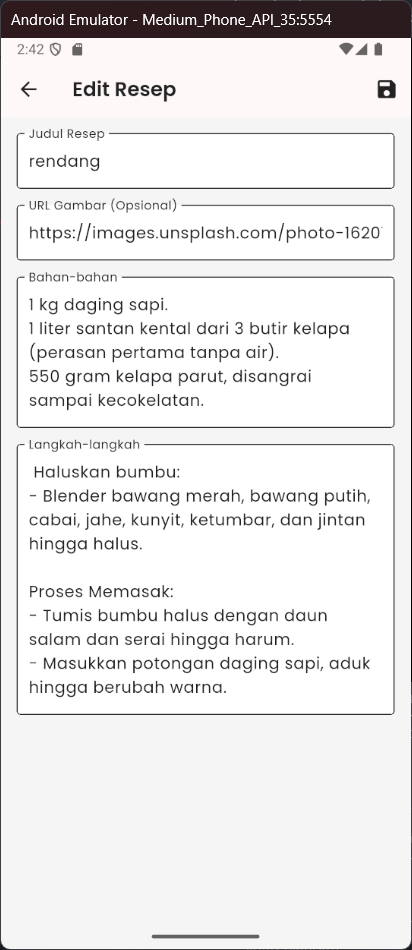 | 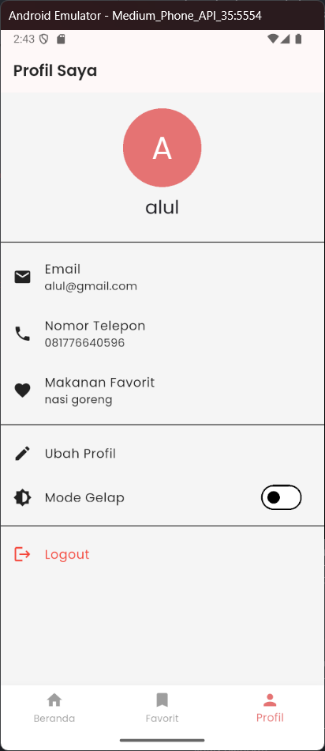 | 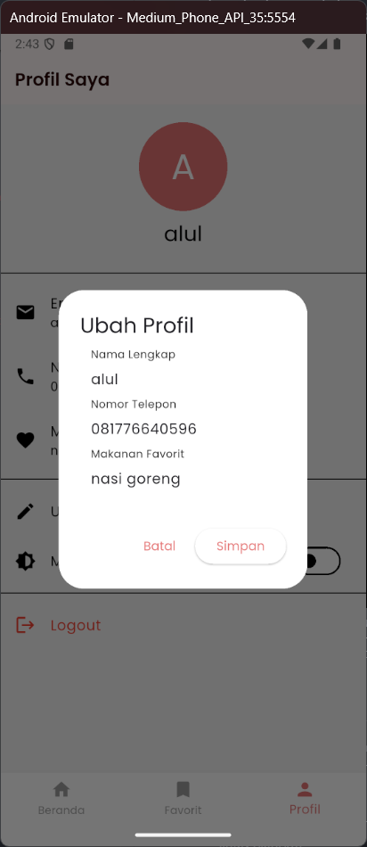 | 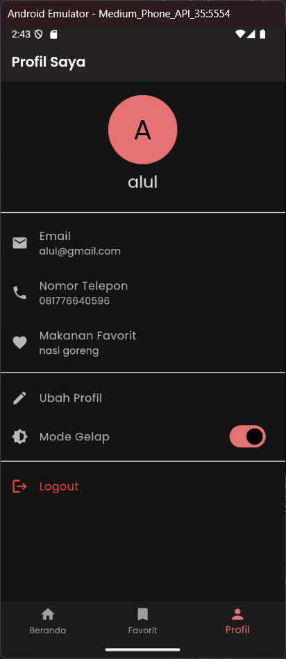 |  | 

| Resep | Search | NavigationRail | 
|------------|--------|-------------|
| 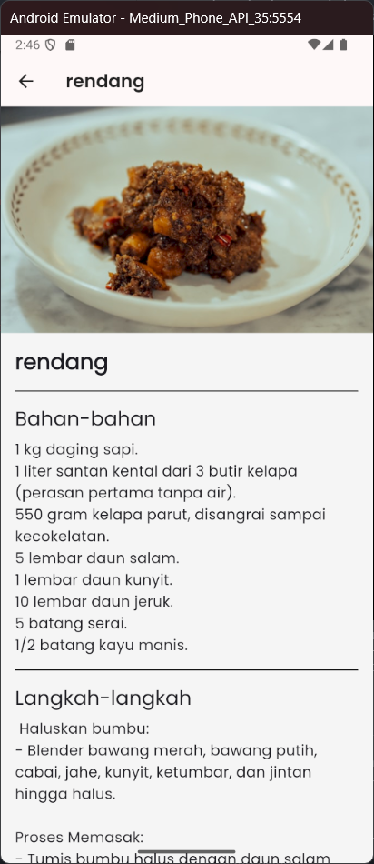 | 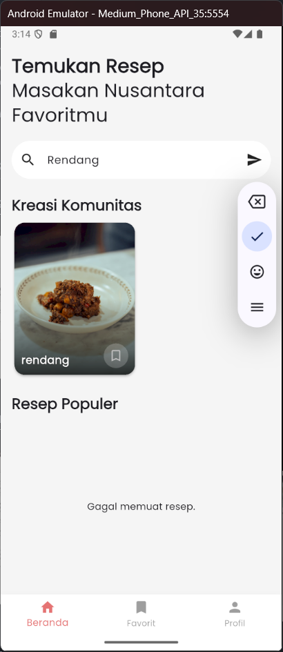 | 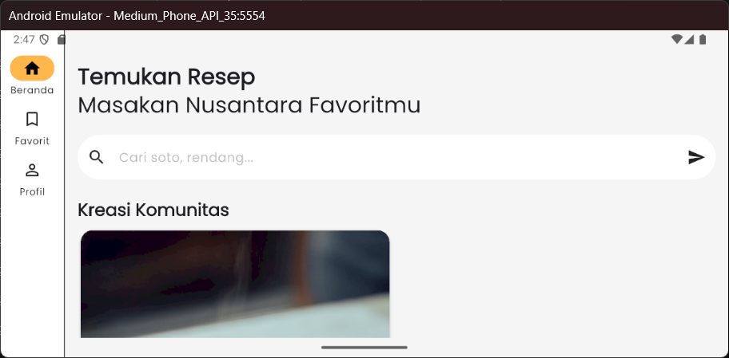 | 

## Link Youtube
 https://youtu.be/64YjoQCFnyE

## Dependensi

Proyek ini menggunakan beberapa dependensi Flutter untuk mendukung pengembangan dan fungsionalitas aplikasi. Berikut adalah dependensi yang digunakan dalam proyek ini:

- *flutter*: Framework untuk mengembangkan aplikasi lintas platform.
- *cupertino_icons*: Untuk menggunakan ikon khas iOS di aplikasi.
- *http*: Untuk mengakses data melalui jaringan menggunakan HTTP.
- *provider*: Untuk manajemen status aplikasi.
- *sqflite*: Untuk penyimpanan data lokal menggunakan SQLite.
- *path*: Untuk menangani path sistem file.
- *path_provider*: Untuk menyediakan path direktori penyimpanan aplikasi di berbagai platform.
- *google_fonts*: Untuk menggunakan font Google di aplikasi.
- *crypto*: Untuk enkripsi dan dekripsi password.


## Penjelasan Program
### 1. main.dart
   - *Fungsi Utama*: main.dart adalah titik masuk utama untuk aplikasi Flutter. File ini berisi fungsi main() yang menjalankan aplikasi dengan widget utama MyApp.

### 2. api_service.dart
   - *Fungsi Utama*: File ini berisi layanan yang digunakan untuk berkomunikasi dengan API eksternal (misalnya, API untuk mendapatkan resep). Layanan ini biasanya menggunakan HTTP untuk meminta data dari server.
   - *Metode Utama*: 
     - Mengambil data resep dari API.
     - Mengelola proses pengambilan data, termasuk penanganan error.

### 3. *data/database_helper.dart*
   - *Fungsi Utama*: File ini digunakan untuk mengelola database lokal aplikasi. Biasanya menggunakan SQLite untuk menyimpan dan mengakses data secara lokal.
   - *Fungsi Utama*: 
     - Menyimpan dan mengambil data resep.
     - Menyimpan preferensi pengguna seperti tema atau data autentikasi.

### 4. *providers/auth_provider.dart*
   - *Fungsi Utama*: Mengelola status autentikasi pengguna. 
   - *Provider* ini bertanggung jawab untuk menangani login, registrasi, dan status pengguna yang sedang aktif.
   - *Metode Utama*: 
     - Login: Melakukan autentikasi pengguna menggunakan API atau metode otentikasi lain.
     - Registrasi: Menyimpan data pengguna baru.
     - Status Pengguna: Menyimpan dan memeriksa status apakah pengguna sudah login atau belum.

### 5. *providers/recipe_provider.dart*
   - *Fungsi Utama*: Provider ini mengelola data resep dalam aplikasi.
   - *Metode Utama*: 
     - Mendapatkan resep dari API atau database lokal.
     - Menyediakan data resep ke tampilan aplikasi sehingga pengguna dapat melihatnya.
     - Mengelola perubahan data resep seperti menambahkan atau mengedit resep.

### 6. *providers/theme_provider.dart*
   - *Fungsi Utama*: Menyediakan dan mengelola pengaturan tema aplikasi.
   - *Metode Utama*: 
     - Menyimpan preferensi tema (gelap atau terang).
     - Mengubah tema aplikasi secara dinamis.

### 7. *screens/auth/*
   - *Fungsi Utama*: Menampilkan tampilan login dan registrasi bagi pengguna.
   - *Widget Utama*: 
     - LoginScreen: Halaman yang menampilkan form untuk login pengguna.
     - RegisterScreen: Halaman untuk registrasi pengguna baru.

### 8. *screens/detail/*
   - *Fungsi Utama*: Menampilkan detail resep termasuk bahan dan cara pembuatan.
   - *Widget Utama*: 
     - RecipeDetailScreen: Halaman untuk menampilkan detail resep yang dipilih.

### 9. *screens/main/*
   - *Fungsi Utama*: Menampilkan tampilan utama aplikasi setelah pengguna login.
   - *Widget Utama*: 
     - HomeScreen: Tampilan yang menunjukkan daftar resep Nusantara dan memungkinkan pengguna untuk menelusuri dan melihat detail resep.

### 10. *widgets/password_field.dart*
   - *Fungsi Utama*: Widget kustom untuk menampilkan field input password dengan keamanan (misalnya, tampilan bintang untuk password).
   - *Fitur*: Memungkinkan pengguna untuk memasukkan password dengan aman.

### 11. *widgets/recipe_card.dart*
   - *Fungsi Utama*: Widget untuk menampilkan resep dalam bentuk kartu yang mudah dibaca.
   - *Fitur*: Menampilkan gambar, nama resep, dan ringkasan singkat tentang resep tersebut. Kartu ini dapat ditekan untuk melihat detail lebih lanjut.

### 12. *utils/app_theme.dart*
   - *Fungsi Utama*: File ini berisi pengaturan tema untuk aplikasi.
   - *Fitur*: Menyediakan tema gelap dan terang untuk aplikasi.

### 13. *utils/constants.dart*
   - *Fungsi Utama*: Menyimpan konstanta yang digunakan di seluruh aplikasi, seperti string, URL API, dan kunci penting lainnya.
   - *Fitur*: Memudahkan pemeliharaan kode dan pengelolaan nilai tetap yang digunakan di beberapa tempat.

## Alur Kerja Aplikasi

1. Pengguna pertama kali dibawa ke layar login atau registrasi (tergantung status autentikasi).
2. Setelah login, pengguna akan dibawa ke halaman utama yang menampilkan daftar resep Nusantara.
3. Pengguna dapat menekan kartu resep untuk melihat detail lengkapnya.
4. Aplikasi mendukung pengelolaan tema (terang atau gelap), serta penyimpanan preferensi pengguna seperti data login.

## Cara Menjalankan Aplikasi:
```bash
flutter pub get
flutter run